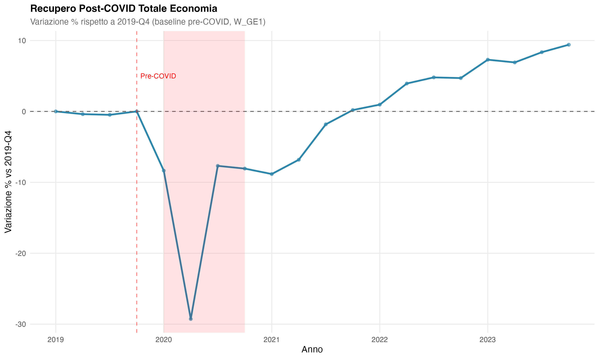
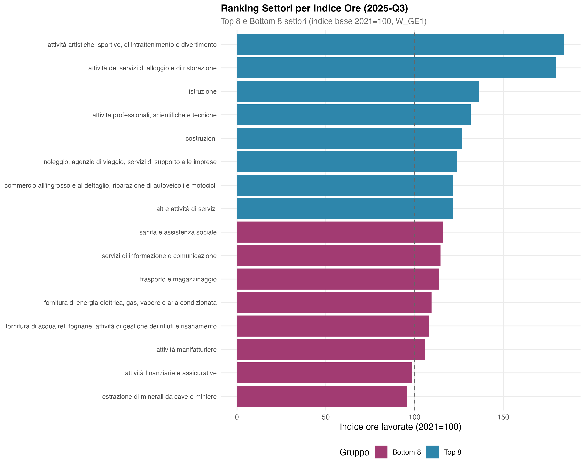
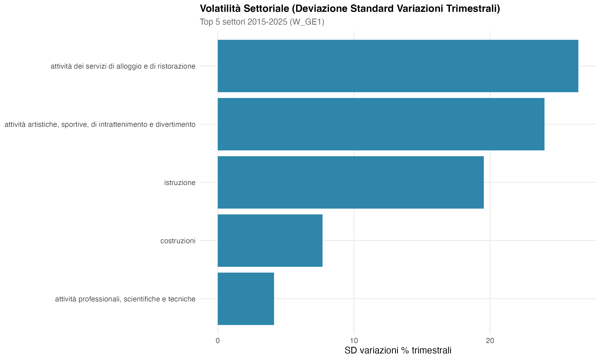
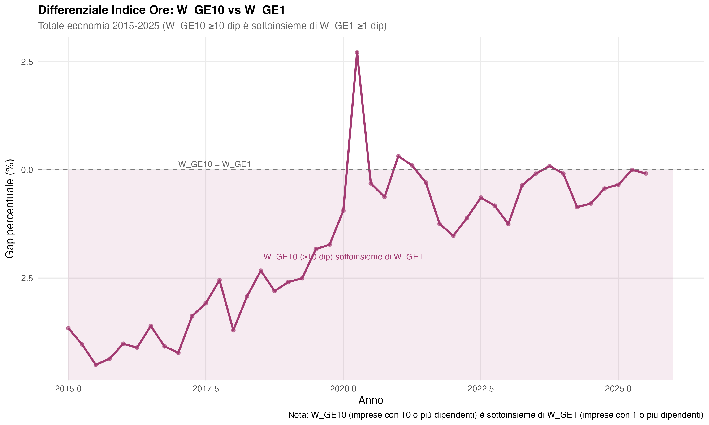

```{r setup, include=FALSE}
knitr::opts_chunk$set(
  echo = FALSE,
  message = FALSE,
  warning = FALSE,
  fig.width = 10,
  fig.height = 6,
  fig.align = "center",
  out.width = "100%"
)

library(dplyr)
library(tidyr)
library(ggplot2)
library(knitr)
library(kableExtra)

# Funzione helper per formattare crescita
format_crescita <- function(value) {
  if (is.na(value)) {
    return("N/A")
  } else if (value >= 0) {
    sprintf("crescita del %.1f%%", value)
  } else {
    sprintf("contrazione del %.1f%%", abs(value))
  }
}
```

# Introduzione

## Contesto

L'indice ore lavorate rappresenta un indicatore chiave del mercato del lavoro, complementare ai dati occupazionali. Questo rapporto presenta un'analisi completa dell'indice ISTAT MHOUR_JV (Monte Ore Lavorate) per le imprese italiane con dipendenti nel periodo 2015-2025.

**NOTA METODOLOGICA IMPORTANTE**: MHOUR_JV è un **indice a base fissa** (2021=100), **non** un valore assoluto in migliaia di ore. I valori rappresentano l'evoluzione delle ore lavorate relative al 2021, consentendo confronti temporali e settoriali sulla dinamica del volume di lavoro.

L'analisi si basa sull'aggregato ufficiale ISTAT codice "0015" (TOTALE INDUSTRIA E SERVIZI b-n) per le analisi di livello nazionale, ed esamina separatamente 16 settori macro (lettere NACE) e due classificazioni dimensionali:

- **W\_GE1**: imprese con **1 o più dipendenti** (≥1 dipendente) - comprende TUTTE le imprese con dipendenti
- **W\_GE10**: imprese con **10 o più dipendenti** (≥10 dipendenti) - **sottoinsieme** di W\_GE1

**IMPORTANTE**: W\_GE10 è un sottoinsieme di W\_GE1, non una categoria separata. Il confronto misura la quota delle imprese medio-grandi sul totale.

## Obiettivi

Questa analisi si propone di:

1. **Documentare l'evoluzione dell'indice** MHOUR_JV nel periodo 2015-2025
2. **Quantificare l'impatto COVID-19** sulla dinamica del volume di lavoro settoriale
3. **Identificare pattern settoriali** in termini di crescita, volatilità e shock
4. **Analizzare effetti dimensionali** confrontando W_GE1 e W_GE10
5. **Fornire evidenze empiriche** sulla struttura produttiva italiana

## Dati

I dati provengono dal dataset ISTAT `imprese_con_dipendenti` e coprono:

- **Periodo**: 2015-Q1 to 2025-Q3 (43 trimestri, frequenza quarterly)
- **Indicatore**: MHOUR\_JV (indice ore lavorate, base 2021=100)
- **Versioni**: MHOUR\_JV_2021 (usata per questo report, dati destagionalizzati)
- **Dimensioni**: 16 settori NACE macro (lettere B-S) + aggregati ufficiali
- **Classificazione dimensionale**: W\_GE1, W\_GE10
- **Codice "0015"**: TOTALE INDUSTRIA E SERVIZI (b-n), aggregato nazionale ufficiale

```{r load-data}
# Carica sintesi risultati
sintesi <- readRDS("output/sintesi_imprese.rds")
totale_economia <- readRDS("output/totale_economia_0015.rds")
stat_settori <- readRDS("output/stat_descrittive_settori.rds")
ranking_settori <- readRDS("output/ranking_settori_indice_2025Q3.rds")
decomp_crescita <- readRDS("output/decomposizione_crescita_settori.rds")
decomp_totale <- readRDS("output/decomposizione_crescita_totale.rds")
volatilita_settori <- readRDS("output/volatilita_settori.rds")
confronto_dimensione <- readRDS("output/confronto_dimensione_aziendale.rds")
```

# Dati e Metodologia

## Fonte Dati

I dati provengono dalle rilevazioni ISTAT sulle ore lavorate nelle imprese con dipendenti. L'indicatore **MHOUR_JV** (Monte Ore Lavorate, Job Vacancies) è un indice a base fissa (2021=100) disponibile in tre versioni:

- **MHOUR\_JV_1**: periodo 2003-Q3 to 2017-Q4 (metodologia iniziale)
- **MHOUR\_JV_2**: periodo 2015-Q1 to 2023-Q4 (revisione intermedia)
- **MHOUR\_JV_2021**: periodo 2015-Q1 to 2025-Q3 (metodologia corrente, **base 2021=100**)

Per garantire coerenza temporale, questo rapporto utilizza **esclusivamente MHOUR\_JV_2021** per l'intero periodo 2015-2025. I dati sono **destagionalizzati** (ADJUSTMENT = "Y") per rimuovere pattern stagionali ricorrenti.

## Classificazione Settoriale

I dati sono classificati secondo **NACE Rev. 2007** con:

- **Settori macro**: 16 settori identificati da lettere singole (B-S)
- **Aggregati ufficiali**: codici numerici (es. 0011, 0013, **0015**)
- **Codice "0015"**: TOTALE INDUSTRIA E SERVIZI (b-n), aggregato ufficiale nazionale

**IMPORTANTE**: Gli indici settoriali NON vanno sommati tra loro. Per analisi nazionali si usa il codice "0015", che rappresenta l'aggregato ufficiale pesato da ISTAT.

## Classificazione Dimensionale

Le imprese sono classificate secondo il numero di dipendenti:

- **W\_GE1**: imprese con **1 o più dipendenti** (≥1 dipendente) - label ufficiale "1 e più"
- **W\_GE10**: imprese con **10 o più dipendenti** (≥10 dipendenti) - label ufficiale "10 e più"

**NOTA IMPORTANTE**: W\_GE10 è un **sottoinsieme** di W\_GE1. La label "1 e più" significa che la classe comprende le imprese con dipendenti ≥1, mentre "10 e più" significa imprese con dipendenti ≥10. Quindi tutte le imprese in W\_GE10 sono anche in W\_GE1.

## Elaborazioni

Le elaborazioni principali includono:

- **Variazioni temporali**: QoQ (quarter-on-quarter) e YoY (year-on-year)
- **Volatilità settoriale**: deviazione standard delle variazioni trimestrali
- **CAGR**: Tasso di crescita annuale composto 2015-2025 (10.5 anni)
- **Gap dimensionale**: differenziale percentuale W\_GE10 vs W\_GE1

# Risultati Aggregati

## Evoluzione Nazionale

```{r tab-sintesi}
cat(sprintf("**Indice Totale Economia 2025-Q3**: %.1f (base 2021=100)\n", sintesi$indice_totale_2025Q3))
cat(sprintf("**Variazione 2015-2025**: %s\n", format_crescita(sintesi$crescita_totale_2015_2025)))
cat(sprintf("**CAGR 2015-2025**: %.2f%%\n\n", sintesi$cagr_totale))
```

L'indice MHOUR_JV per il totale economia (codice 0015, W\_GE1) mostra **`r format_crescita(sintesi$crescita_totale_2015_2025)`** nel periodo 2015-Q1 to 2025-Q3, corrispondente a un CAGR del **`r sprintf("%.2f%%", sintesi$cagr_totale)`**.

Il valore 2025-Q3 di **`r sprintf("%.1f", sintesi$indice_totale_2025Q3)`** indica che le ore lavorate sono aumentate del **`r sprintf("%.1f%%", sintesi$indice_totale_2025Q3 - 100)`** rispetto al 2021.

```{r fig-evoluzione, fig.cap="Evoluzione indice ore lavorate totale economia (codice 0015). W\\_GE1 (imprese con 1 o più dipendenti) e W\\_GE10 (imprese con 10 o più dipendenti, sottoinsieme di W\\_GE1).", fig.width=10, fig.height=6}
knitr::include_graphics("output/grafici/21_evoluzione_indice_totale.png")
```

La Figura mostra l'evoluzione dell'indice per entrambe le classificazioni dimensionali, con evidenza dello shock COVID-19 nel 2020-Q2 e il recupero successivo. Il superamento della base 100 (anno 2021) avviene nel 2023 per entrambe le popolazioni.

## Shock COVID-19

L'impatto della pandemia COVID-19 è visibile come forte contrazione nel 2020-Q2, seguito da recupero graduale nel 2020-2021. Il ritorno ai livelli pre-COVID (baseline 2019-Q4) avviene nel 2023-Q1 per W\_GE1.

```{r fig-recupero-covid, fig.cap="Recupero post-COVID rispetto alla baseline 2019-Q4. Il ritorno ai livelli pre-pandemici richiede circa 3 anni.", fig.width=10, fig.height=6}

```

## Variazioni Temporali

```{r fig-variazioni, fig.cap="Variazioni percentuali trimestrali e annuali dell'indice MHOUR\\_JV (W\\_GE1). Le variazioni trimestrali mostrano maggiore volatilità.", fig.width=10, fig.height=6}
knitr::include_graphics("output/grafici/27_variazioni_totale.png")
```

Le variazioni trimestrali oscillano tra -5% e +5%, con picchi negativi durante COVID-19. Le variazioni annuali mostrano trend più stabile, confermando la natura temporanea degli shock.

# Analisi Settoriale

## Ranking Settori 2025-Q3

```{r tab-ranking}
ranking_top10 <- ranking_settori %>%
  head(10) %>%
  select(settore_macro_label, ore_migliaia) %>%
  rename(
    "Settore" = settore_macro_label,
    "Indice 2025-Q3" = ore_migliaia
  )

kable(
  ranking_top10,
  format = "latex",
  booktabs = TRUE,
  caption = "Top 10 settori per indice ore lavorate 2025-Q3 (W\\_GE1)",
  digits = 1
) %>%
  kable_styling(latex_options = c("hold_position"))
```

Il settore con l'indice più elevato nel 2025-Q3 è **`r sintesi$settore_max_indice_2025`** (indice `r ranking_settori$ore_migliaia[1]`), seguito da servizi di alloggio/ristorazione e istruzione. Questi settori mostrano una forte espansione post-COVID, superando significativamente i livelli del 2021.

```{r fig-ranking, fig.cap="Ranking settori per indice ore 2025-Q3. Top 8 e Bottom 8 settori mostrano forte eterogeneità settoriale.", fig.width=10, fig.height=8}

```

## Crescita Settoriale 2015-2025

```{r tab-crescita-settoriale}
crescita_top5 <- decomp_crescita %>%
  arrange(desc(var_percentuale)) %>%
  head(5) %>%
  select(settore_macro_label, indice_2015Q1, indice_2025Q3, var_percentuale, cagr) %>%
  rename(
    "Settore" = settore_macro_label,
    "Indice 2015-Q1" = indice_2015Q1,
    "Indice 2025-Q3" = indice_2025Q3,
    "Variazione %" = var_percentuale,
    "CAGR %" = cagr
  )

kable(
  crescita_top5,
  format = "latex",
  booktabs = TRUE,
  caption = "Top 5 settori per crescita indice 2015-2025 (W\\_GE1)",
  digits = c(0, 1, 1, 1, 2)
) %>%
  kable_styling(latex_options = c("hold_position", "scale_down"))
```

Il settore con la massima crescita è **`r sintesi$settore_max_crescita`**, mentre il minimo è **`r sintesi$settore_min_crescita`**.

```{r fig-crescita, fig.cap="Crescita settoriale 2015-Q1 to 2025-Q3. Forte eterogeneità tra settori, con dinamiche post-COVID divergenti.", fig.width=10, fig.height=8}
knitr::include_graphics("output/grafici/23_crescita_settoriale.png")
```

```{r fig-cagr, fig.cap="CAGR settoriale 2015-2025. Tassi di crescita annuali composti mostrano pattern strutturali.", fig.width=10, fig.height=8}
knitr::include_graphics("output/grafici/31_cagr_settoriale.png")
```

## Volatilità Settoriale

```{r tab-volatilita}
vol_top5 <- volatilita_settori %>%
  head(5) %>%
  select(settore_macro_label, sd_var_trim, mean_var_trim, cv_indice) %>%
  rename(
    "Settore" = settore_macro_label,
    "SD Var% Trim" = sd_var_trim,
    "Media Var% Trim" = mean_var_trim,
    "CV Indice" = cv_indice
  )

kable(
  vol_top5,
  format = "latex",
  booktabs = TRUE,
  caption = "Top 5 settori per volatilità (SD variazioni trimestrali)",
  digits = 3
) %>%
  kable_styling(latex_options = c("hold_position"))
```

Il settore più volatile è **`r sintesi$settore_piu_volatile`**, riflettendo la sensibilità ai cicli economici e agli shock esogeni (es. COVID-19).

```{r fig-volatilita, fig.cap="Volatilità settoriale misurata come deviazione standard delle variazioni trimestrali.", fig.width=10, fig.height=6}

```

```{r fig-scatter-vol-crescita, fig.cap="Relazione volatilità-crescita settoriale. Settori con alta crescita mostrano maggiore volatilità.", fig.width=10, fig.height=6}
knitr::include_graphics("output/grafici/29_scatter_volatilita_crescita.png")
```

## Shock COVID-19 Settoriale

```{r fig-shock-covid, fig.cap="Impatto COVID-19 per settore (variazione % 2019 vs 2020). Servizi di alloggio/ristorazione e attività artistiche mostrano i maggiori shock negativi.", fig.width=10, fig.height=6}
knitr::include_graphics("output/grafici/32_shock_covid_settori.png")
```

L'impatto settoriale del COVID-19 mostra forte eterogeneità. I settori dei servizi di consumo (alloggio, ristorazione, attività artistiche) subiscono i maggiori shock negativi, mentre alcuni settori industriali e servizi essenziali resistono meglio.

# Analisi Dimensionale

## Gap W\_GE10 vs W\_GE1

Il differenziale tra imprese con 10 o più dipendenti (W\_GE10) e imprese con 1 o più dipendenti (W\_GE1) mostra un gap medio di **`r sprintf("%.2f%%", sintesi$gap_W_GE10_medio)`** nel periodo 2015-2025.

**INTERPRETAZIONE CORRETTA**: Poiché W\_GE10 (imprese ≥10 dipendenti) è un **sottoinsieme** di W\_GE1 (imprese ≥1 dipendente), il gap misura la quota relativa delle imprese medio-grandi sul totale delle ore lavorate.

Un gap negativo significa che l'indice delle imprese ≥10 dipendenti è inferiore all'indice di tutte le imprese. Questo è **matematicamente normale** per un sottoinsieme e non implica necessariamente differenze strutturali, ma semplicemente che le imprese con 1-9 dipendenti contribuiscono una quota significativa alle ore totali.

```{r tab-gap-dimensionale}
gap_stats <- data.frame(
  Metrica = c("Gap medio periodo", "Gap 2025-Q3", "Gap min", "Gap max"),
  Valore = c(
    sprintf("%.2f%%", sintesi$gap_W_GE10_medio),
    sprintf("%.2f%%", sintesi$gap_W_GE10_2025Q3),
    sprintf("%.2f%%", min(confronto_dimensione$diff_percentuale)),
    sprintf("%.2f%%", max(confronto_dimensione$diff_percentuale))
  )
)

kable(
  gap_stats,
  format = "latex",
  booktabs = TRUE,
  caption = "Statistiche gap W\\_GE10 vs W\\_GE1 (W\\_GE10 ≥10 dip è sottoinsieme di W\\_GE1 ≥1 dip)"
) %>%
  kable_styling(latex_options = c("hold_position"))
```

```{r fig-gap, fig.cap="Evoluzione gap percentuale W\\_GE10 vs W\\_GE1. W\\_GE10 (imprese con 10 o più dipendenti) è un sottoinsieme di W\\_GE1 (imprese con 1 o più dipendenti).", fig.width=10, fig.height=6}

```

Il gap si è ridotto nel tempo, passando da circa -4% nel 2015 a circa 0% nel 2025, suggerendo che la quota delle imprese con 10 o più dipendenti sul totale ore lavorate è aumentata nel periodo.

# Sintesi e Conclusioni

## Fatti Stilizzati

L'analisi dell'indice MHOUR_JV per il periodo 2015-2025 evidenzia i seguenti fatti stilizzati:

1. **Crescita aggregata**: Il totale economia (codice 0015, W\_GE1) mostra **`r format_crescita(sintesi$crescita_totale_2015_2025)`** con CAGR del `r sprintf("%.2f%%", sintesi$cagr_totale)`

2. **Shock COVID-19**: Forte contrazione nel 2020-Q2, con recupero ai livelli pre-COVID nel 2023-Q1 (circa 3 anni)

3. **Eterogeneità settoriale**: Forte divergenza tra settori, con servizi di consumo (alloggio, ristorazione, attività artistiche) in forte espansione post-COVID, e settori estrattivi in contrazione

4. **Gap dimensionale**: Le imprese con 10 o più dipendenti (W\_GE10, sottoinsieme di W\_GE1) mostrano un gap medio di **`r sprintf("%.1f%%", sintesi$gap_W_GE10_medio)`**, in riduzione verso 0% nel tempo

5. **Volatilità**: I settori dei servizi di consumo sono i più volatili, mentre servizi professionali e finanziari sono più stabili

## Implicazioni

I risultati suggeriscono:

- **Composizione settoriale**: La struttura produttiva italiana mostra forte eterogeneità, con settori dei servizi in espansione e settori tradizionali in trasformazione

- **Effetti COVID-19 persistenti**: Alcuni settori (alloggio, ristorazione, cultura) mostrano dinamiche post-pandemiche strutturalmente diverse dal periodo pre-COVID

- **Composizione dimensionale**: Il gap W\_GE10 vs W\_GE1 in riduzione suggerisce crescente peso delle imprese con 10 o più dipendenti sul totale ore lavorate

## Limitazioni

- **Natura dell'indice**: MHOUR_JV è un indice (base 2021=100), non un valore assoluto. I confronti cross-section tra settori vanno interpretati come dinamiche relative

- **Destagionalizzazione**: I dati sono destagionalizzati, rimuovendo pattern ricorrenti ma potenzialmente mascherando dinamiche stagionali reali

- **Aggregazione nazionale**: L'analisi si basa sul codice "0015" (totale industria e servizi b-n), escludendo alcuni settori (es. agricoltura, pubblica amministrazione)

- **Relazione dimensionale**: W\_GE10 (imprese ≥10 dipendenti) è un sottoinsieme di W\_GE1 (imprese ≥1 dipendente), quindi il gap misura la quota relativa, non differenze strutturali

## Sviluppi Futuri

Possibili estensioni dell'analisi includono:

- **Analisi regionale**: Disaggregazione per regioni/province
- **Decomposizione settoriale dettagliata**: Uso di codici NACE a 4 cifre dove disponibili
- **Analisi causale**: Modelli econometrici per identificare determinanti della dinamica settoriale
- **Confronti internazionali**: Benchmarking con altri paesi UE

# Appendice Tecnica

## Versioni dell'Indicatore MHOUR\_JV

L'indicatore ISTAT MHOUR_JV ha subito revisioni metodologiche nel tempo:

| Versione | Periodo di Copertura | Note |
|----------|---------------------|------|
| MHOUR\_JV_1 | 2003-Q3 to 2017-Q4 | Metodologia iniziale |
| MHOUR\_JV_2 | 2015-Q1 to 2023-Q4 | Revisione intermedia |
| MHOUR\_JV_2021 | 2015-Q1 to 2025-Q3 | **Base 2021=100**, metodologia corrente |

Questo rapporto utilizza esclusivamente MHOUR\_JV_2021 per garantire coerenza metodologica.

## Gestione Versioni

Per evitare discontinuità, lo script di preparazione dati (`09_prepara_imprese.R`) implementa un sistema di priorità:

- **Priorità 1**: MHOUR\_JV_2021 (usato quando disponibile)
- **Priorità 2**: MHOUR\_JV_2
- **Priorità 3**: MHOUR\_JV_1

Nel periodo 2015-2025 analizzato, solo MHOUR\_JV_2021 è disponibile e viene utilizzato uniformemente.

## Destagionalizzazione

I dati utilizzano la serie con ADJUSTMENT = "Y" (seasonally adjusted), che rimuove pattern stagionali ricorrenti. Questo consente di analizzare trend e cicli economici senza distorsioni stagionali, ma implica che le variazioni trimestrali riflettono solo componenti trend-cicliche.

## Codici Settoriali

### Settori Macro (Lettere NACE)

- **B**: Estrazione di minerali da cave e miniere
- **C**: Attività manifatturiere
- **D**: Fornitura di energia elettrica, gas, vapore
- **E**: Fornitura di acqua, reti fognarie
- **F**: Costruzioni
- **G**: Commercio all'ingrosso e dettaglio
- **H**: Trasporto e magazzinaggio
- **I**: Servizi di alloggio e ristorazione
- **J**: Servizi di informazione e comunicazione
- **K**: Attività finanziarie e assicurative
- **M**: Attività professionali, scientifiche, tecniche
- **N**: Noleggio, agenzie di viaggio, supporto imprese
- **P**: Istruzione
- **Q**: Sanità e assistenza sociale
- **R**: Attività artistiche, sportive, intrattenimento
- **S**: Altre attività di servizi

### Aggregati Ufficiali

- **0011**: TOTALE INDUSTRIA (b-f)
- **0013**: TOTALE SERVIZI DI MERCATO (g-n)
- **0015**: **TOTALE INDUSTRIA E SERVIZI (b-n)** ← Usato per analisi nazionale
- **0020**: TOTALE INDUSTRIA ESCLUSE COSTRUZIONI (b-e)
- Altri codici aggregati disponibili nel dataset

## Formule

### CAGR (Compound Annual Growth Rate)

$$CAGR = \left(\frac{V_{2025Q3}}{V_{2015Q1}}\right)^{\frac{1}{10.5}} - 1$$

dove 10.5 anni è la durata del periodo 2015-Q1 to 2025-Q3.

### Gap Dimensionale

$$Gap_t = \frac{W\_GE10_t - W\_GE1_t}{W\_GE1_t} \times 100$$

Valori negativi indicano che W\_GE10 < W\_GE1.

### Volatilità

$$\sigma_{QoQ} = \sqrt{\frac{1}{n-1}\sum_{t=1}^{n}\left(r_t - \bar{r}\right)^2}$$

dove $r_t = \frac{V_t - V_{t-1}}{V_{t-1}} \times 100$ è la variazione trimestrale percentuale.

---

**Report generato il** `r format(Sys.Date(), '%d %B %Y')`
**Autore**: Giampaolo Montaletti (ORCID: 0009-0002-5327-1122)
**Fonte dati**: ISTAT - Dataset `imprese_con_dipendenti`, indicatore MHOUR\_JV_2021
