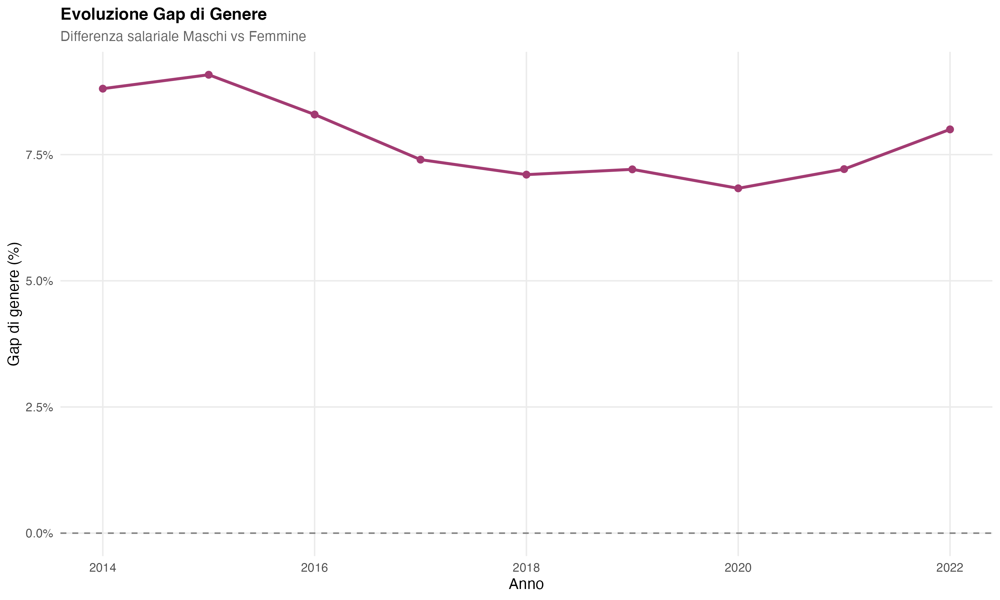
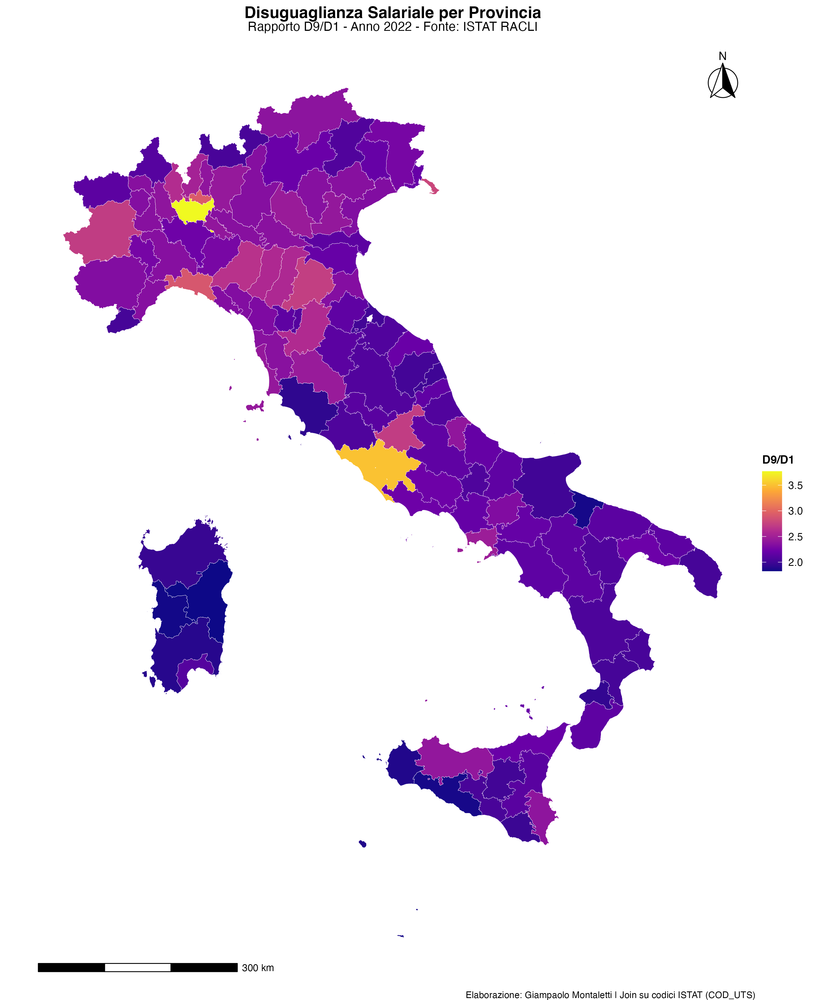
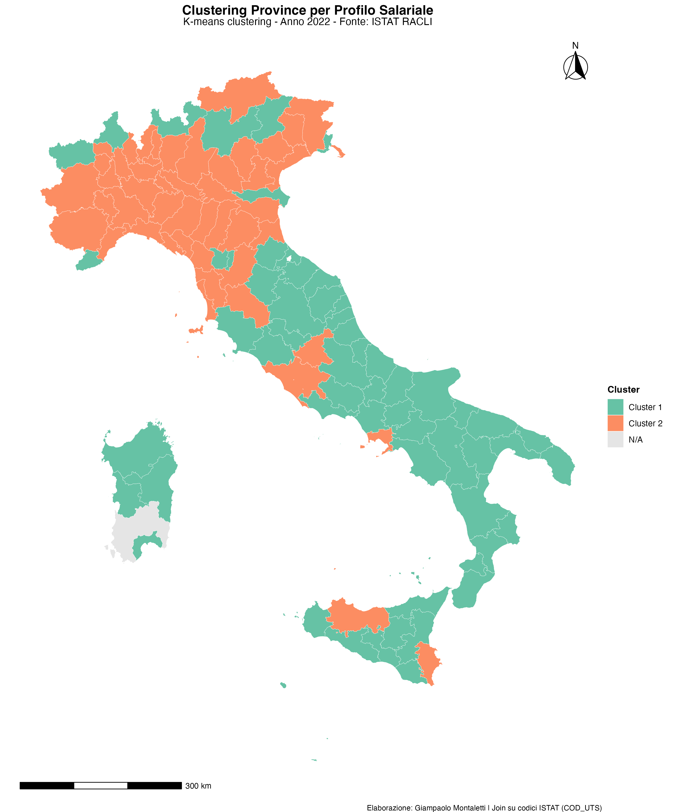
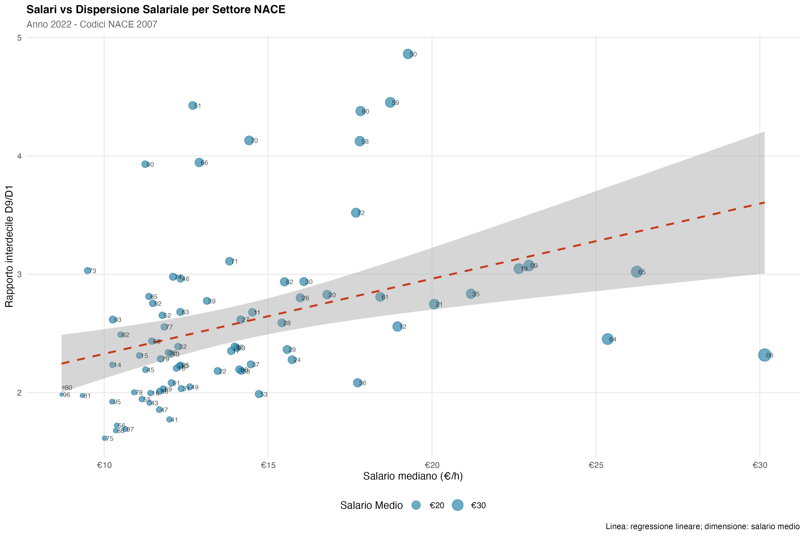
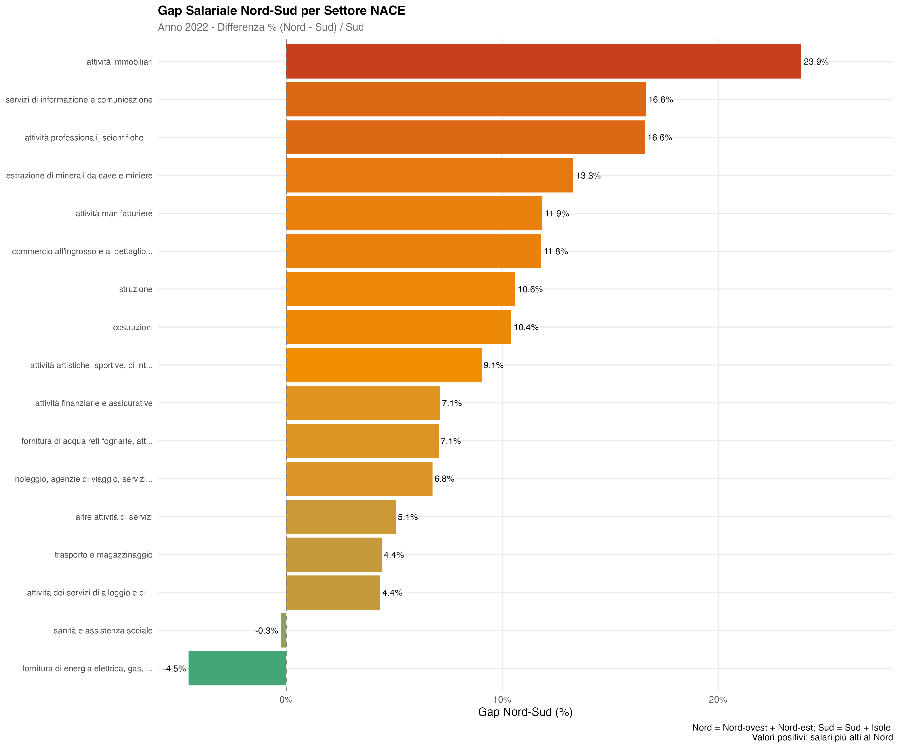
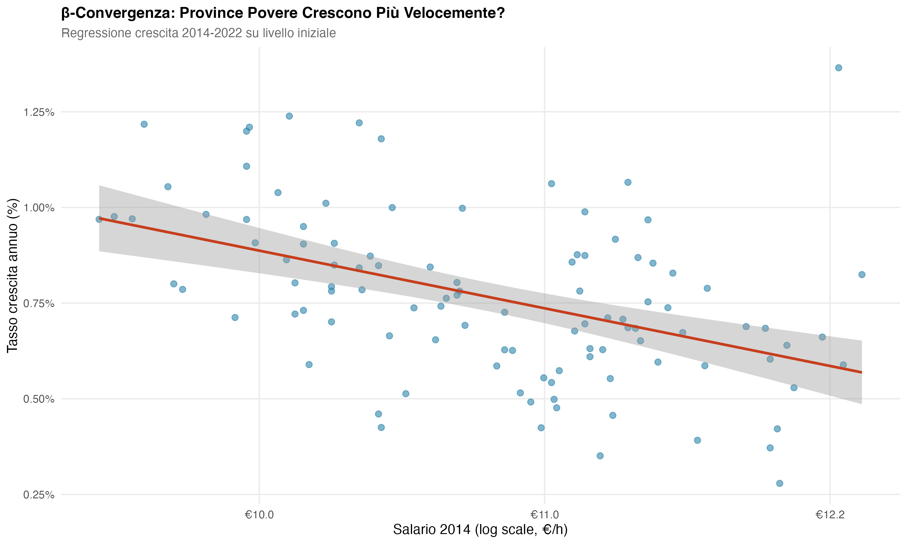
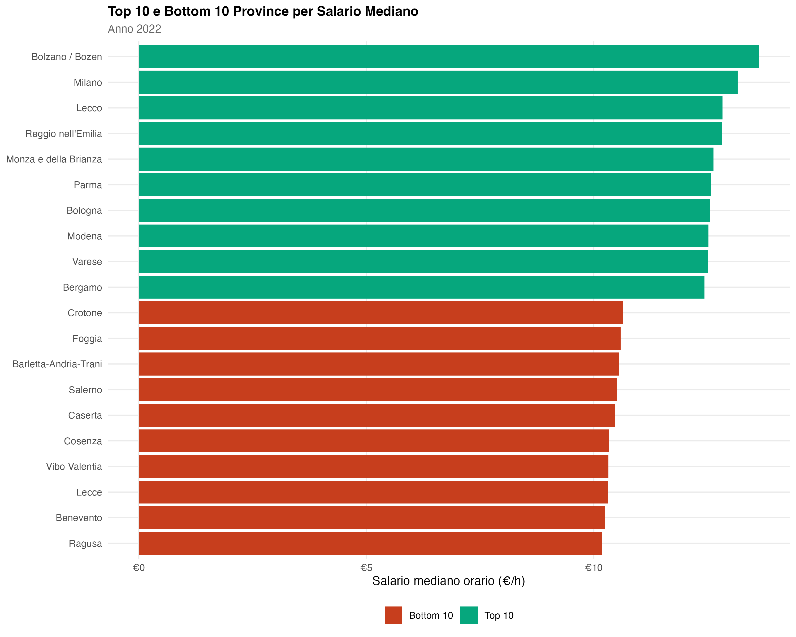
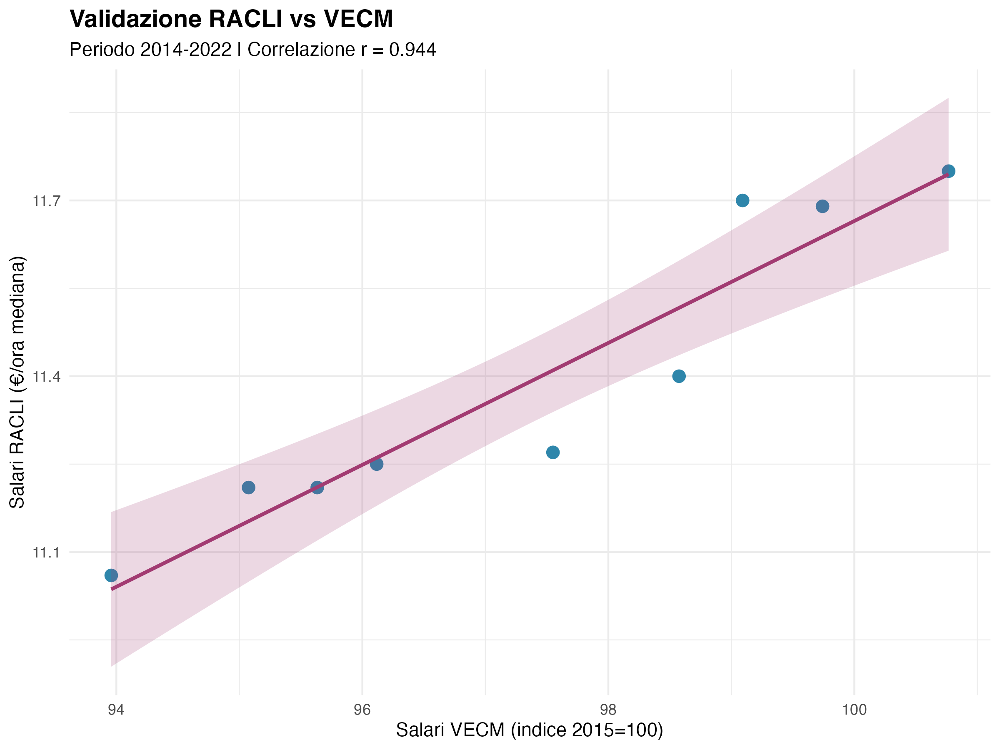

```{r setup, include=FALSE}
knitr::opts_chunk$set(
  echo = FALSE,
  message = FALSE,
  warning = FALSE,
  fig.width = 10,
  fig.height = 6,
  fig.align = "center",
  out.width = "100%"
)

library(dplyr)
library(tidyr)
library(ggplot2)
library(knitr)
library(kableExtra)
```

# Introduzione

## Contesto

Il mercato del lavoro italiano è caratterizzato da significative eterogeneità territoriali, settoriali e demografiche nella distribuzione salariale. Questo rapporto presenta un'analisi completa dei dati ISTAT-RACLI (Registro Amministrativo Costo Lavoro Imprese) sui salari orari lordi in Italia per il periodo 2014-2022.

L'analisi si integra con il modello VECM esistente estendendo la prospettiva dalla dimensione macro-aggregata nazionale alla dimensione micro-settoriale e territoriale, fornendo evidenze empiriche sui differenziali salariali e sulla loro evoluzione temporale.

## Obiettivi

Questa analisi si propone di:

1. **Identificare i principali differenziali salariali** per sesso, livello educativo, tipo di contratto e area geografica
2. **Analizzare la dispersione salariale** attraverso rapporti interdecili, analisi di mobilità temporale e clustering territoriale
3. **Quantificare i determinanti salariali** mediante modelli di regressione multivariata
4. **Documentare evidenze empiriche** sulla convergenza territoriale e l'evoluzione della dispersione salariale

## Dati

I dati provengono dall'indagine ISTAT-RACLI e coprono:

- **Periodo**: 2014-2022 (9 anni, frequenza annuale)
- **Variabili**: retribuzione media oraria + decili D1, D5 (mediana), D9
- **Dimensioni**: sesso, livello educativo, tipo contratto, area geografica
- **Geografia**: 4 livelli NUTS (nazionale, ripartizioni, regioni, province)

```{r load-data}
# Carica sintesi risultati
sintesi_descrittive <- readRDS("output/sintesi_descrittive.rds")
sintesi_distributiva <- readRDS("output/sintesi_distributiva.rds")
sintesi_clustering <- readRDS("output/sintesi_clustering.rds")
sintesi_regressioni <- readRDS("output/sintesi_regressioni.rds")

# Carica dati completi
gap_gender_2022 <- readRDS("output/gap_gender_2022.rds")
gap_educazione_2022 <- readRDS("output/gap_educazione_2022.rds")
gap_contratto_2022 <- readRDS("output/gap_contratto_2022.rds")
stat_ripartizioni_2022 <- readRDS("output/stat_ripartizioni_2022.rds")
```

# Analisi Descrittiva

## Panoramica Nazionale

Nel 2022, il salario mediano orario nazionale si attesta a **€`r sprintf("%.2f", sintesi_descrittive$salario_mediano_nazionale_2022)`/ora**. Nel periodo 2014-2022, i salari sono cresciuti del **`r sprintf("%.1f%%", sintesi_descrittive$crescita_media_2014_2022)`** complessivamente, con un tasso di crescita annuo medio dello **`r sprintf("%.2f%%", sintesi_regressioni$crescita_annua_pct)`**.

```{r fig-evoluzione, fig.cap="Evoluzione salario mediano nazionale 2014-2022", out.width="90%"}
knitr::include_graphics("output/grafici/01_evoluzione_salari_nazionale.png")
```

## Differenziali di Genere

Il gap salariale di genere nel 2022 è pari all'**`r sprintf("%.1f%%", sintesi_descrittive$gap_gender_medio_2022)`**, in calo rispetto all'8.8% del 2014. L'analisi di regressione indica una riduzione del gap di **0.26 punti percentuali all'anno**, statisticamente significativa.

```{r tab-gender-gap}
gap_gender_2022 %>%
  select(settore, salario_femmine, salario_maschi, gap_percentuale) %>%
  kable(
    col.names = c("Settore", "Salario F (€/h)", "Salario M (€/h)", "Gap (%)"),
    digits = 2,
    caption = "Gap salariale di genere per settore (2022)",
    booktabs = TRUE
  ) %>%
  kable_styling(latex_options = c("hold_position"))
```

```{r fig-gap-gender, fig.cap="Evoluzione gap di genere 2014-2022", out.width="90%"}

```

\newpage

## Premio Educativo

Il **premio educativo** (differenza salariale tra laureati e lavoratori con istruzione di base) è molto significativo: in media nazionale, i laureati guadagnano il **`r sprintf("%.1f%%", sintesi_regressioni$premio_educativo_medio)`** in più rispetto ai lavoratori con licenza elementare o media.

```{r tab-educazione}
gap_educazione_2022 %>%
  select(educazione, salario_mediano, salario_medio, D9_D1) %>%
  arrange(desc(salario_mediano)) %>%
  kable(
    col.names = c("Livello Educativo", "Salario Mediano", "Salario Medio", "D9/D1"),
    digits = 2,
    caption = "Salari per livello educativo (2022)",
    booktabs = TRUE
  ) %>%
  kable_styling(latex_options = c("hold_position"))
```

```{r fig-educazione, fig.cap="Salari per livello educativo (2022)", out.width="90%"}
knitr::include_graphics("output/grafici/09_salari_educazione.png")
```

## Premio Contratto Permanente

I lavoratori con contratto a tempo indeterminato guadagnano in media il **`r sprintf("%.1f%%", sintesi_regressioni$premio_permanente_medio)`** in più rispetto ai lavoratori a tempo determinato.

```{r tab-contratto}
gap_contratto_2022 %>%
  select(contratto, salario_mediano, salario_medio, D9_D1) %>%
  arrange(desc(salario_mediano)) %>%
  kable(
    col.names = c("Tipo Contratto", "Salario Mediano", "Salario Medio", "D9/D1"),
    digits = 2,
    caption = "Salari per tipo contratto (2022)",
    booktabs = TRUE
  ) %>%
  kable_styling(latex_options = c("hold_position"))
```

```{r fig-contratto, fig.cap="Salari per tipo contratto (2022)", out.width="90%"}
knitr::include_graphics("output/grafici/10_salari_contratto.png")
```

\newpage

# Differenziali Territoriali

## Divario Nord-Sud

Persistono significativi differenziali territoriali nella distribuzione salariale. Le province del Nord-Ovest registrano i salari mediani più elevati (€12.37/h), mentre il Sud presenta i valori più bassi (€10.71/h), con un differenziale del **-13%**.

```{r tab-ripartizioni}
stat_ripartizioni_2022 %>%
  select(ripartizione, salario_mediano, D9_D1) %>%
  arrange(desc(salario_mediano)) %>%
  kable(
    col.names = c("Ripartizione", "Salario Mediano (€/h)", "D9/D1"),
    digits = c(0, 2, 2),
    caption = "Statistiche salariali per ripartizione (2022)",
    booktabs = TRUE
  ) %>%
  kable_styling(latex_options = c("hold_position"))
```

```{r fig-ripartizioni, fig.cap="Salari mediani per ripartizione geografica (2022)", out.width="90%"}
knitr::include_graphics("output/grafici/03_salari_ripartizioni.png")
```

```{r fig-boxplot, fig.cap="Distribuzione salari provinciali per ripartizione (2022)", out.width="90%"}
knitr::include_graphics("output/grafici/06_boxplot_salari_ripartizioni.png")
```

## Cartografie Provinciali

Le mappe seguenti illustrano la distribuzione territoriale dei differenziali salariali a livello provinciale, evidenziando pattern geografici significativi.

```{r fig-mappa-salari, fig.cap="Mappa salari mediani provinciali (2022)", out.width="90%"}
knitr::include_graphics("output/grafici/17_mappa_salari_province_2022.png")
```

La mappa dei salari mediani conferma la persistenza del divario Nord-Sud, con le province del Nord-Ovest (Lombardia, Piemonte) e del Nord-Est (Emilia-Romagna, Veneto) che presentano retribuzioni orarie sistematicamente superiori rispetto al Mezzogiorno.

```{r fig-mappa-crescita, fig.cap="Mappa crescita salariale 2014-2022 (%)", out.width="90%"}
knitr::include_graphics("output/grafici/18_mappa_crescita_salari_2014_2022.png")
```

La mappa della crescita salariale mostra una distribuzione più eterogenea, con alcune province meridionali che registrano tassi di crescita superiori alla media nazionale, coerentemente con le evidenze di $\beta$-convergenza.

```{r fig-mappa-dispersione, fig.cap="Mappa dispersione salariale D9/D1 (2022)", out.width="90%"}

```

Il rapporto interdecile D9/D1 presenta variabilità geografica significativa, con livelli di dispersione salariale più elevati in alcune province metropolitane e nelle aree con maggiore presenza di settori ad alta variabilità retributiva.

```{r fig-mappa-cluster, fig.cap="Mappa clustering k-means province (2022)", out.width="90%"}

```

Il clustering territoriale identifica due profili provinciali distinti: un cluster ad alto reddito (prevalentemente Nord) e un cluster a basso reddito (prevalentemente Sud e Isole), con alcune eccezioni significative che evidenziano dinamiche locali specifiche.

\newpage

# Differenziali Settoriali

## Panoramica Settoriale

L'analisi dei dati RACLI per settore economico (classificazione NACE 2007) consente di identificare significative eterogeneità retributive tra comparti produttivi. L'analisi copre le sezioni NACE principali (B-S), escludendo i settori pubblici (O) e le attività delle famiglie (T).

```{r load-sector-data}
# Carica dati settoriali
ranking_settori_nace <- readRDS("output/ranking_settori_nace_2022.rds")
dispersione_settori <- readRDS("output/dispersione_settori_2022.rds")
gap_gender_settori <- readRDS("output/gap_gender_settori_2022.rds")
```

I settori analizzati presentano una significativa variabilità nei livelli retributivi: il salario mediano orario varia da un minimo di €`r sprintf("%.2f", min(ranking_settori_nace$salario_mediano))` a un massimo di €`r sprintf("%.2f", max(ranking_settori_nace$salario_mediano))`, con un rapporto di circa `r sprintf("%.1f", max(ranking_settori_nace$salario_mediano)/min(ranking_settori_nace$salario_mediano))`:1 tra il settore meglio e peggio retribuito.

## Ranking Settoriale per Livello Retributivo

### Settori ad alta retribuzione

```{r tab-top-settori}
ranking_settori_nace %>%
  mutate(settore = ifelse(nchar(settore) > 45, paste0(substr(settore, 1, 42), "..."), settore)) %>%
  select(settore, salario_mediano, salario_medio, D9_D1) %>%
  head(10) %>%
  kable(
    col.names = c("Settore", "Sal. Med.", "Sal. Medio", "D9/D1"),
    digits = 2,
    caption = "Top 10 settori per salario mediano (2022, €/h)",
    booktabs = TRUE
  ) %>%
  kable_styling(latex_options = c("hold_position"), font_size = 9) %>%
  column_spec(1, width = "6cm")
```

### Settori a bassa retribuzione

```{r tab-bottom-settori}
ranking_settori_nace %>%
  mutate(settore = ifelse(nchar(settore) > 45, paste0(substr(settore, 1, 42), "..."), settore)) %>%
  select(settore, salario_mediano, salario_medio, D9_D1) %>%
  tail(10) %>%
  kable(
    col.names = c("Settore", "Sal. Med.", "Sal. Medio", "D9/D1"),
    digits = 2,
    caption = "Bottom 10 settori per salario mediano (2022, €/h)",
    booktabs = TRUE
  ) %>%
  kable_styling(latex_options = c("hold_position"), font_size = 9) %>%
  column_spec(1, width = "6cm")
```

```{r fig-ranking-settori, fig.cap="Ranking settori NACE per salario mediano (2022)", out.width="90%"}
knitr::include_graphics("output/grafici/16_salari_settori_nace.png")
```

## Dispersione Salariale Intra-Settoriale

La dispersione salariale interna ai settori, misurata dal rapporto interdecile D9/D1, varia significativamente: da un minimo di `r sprintf("%.2f", min(dispersione_settori$D9_D1, na.rm=TRUE))` a un massimo di `r sprintf("%.2f", max(dispersione_settori$D9_D1, na.rm=TRUE))`. Settori con elevata dispersione tendono ad avere una maggiore eterogeneità nelle qualifiche e nelle mansioni.

```{r tab-dispersione-settori}
dispersione_settori %>%
  mutate(settore = ifelse(nchar(settore) > 45, paste0(substr(settore, 1, 42), "..."), settore)) %>%
  select(settore, salario_mediano, D9_D1, D9_D5, D5_D1) %>%
  arrange(desc(D9_D1)) %>%
  head(10) %>%
  kable(
    col.names = c("Settore", "Sal. Med.", "D9/D1", "D9/D5", "D5/D1"),
    digits = 2,
    caption = "Settori con maggiore dispersione salariale (D9/D1, 2022, €/h)",
    booktabs = TRUE
  ) %>%
  kable_styling(latex_options = c("hold_position"), font_size = 9) %>%
  column_spec(1, width = "6cm")
```

```{r fig-scatter-settori, fig.cap="Relazione tra livello salariale e dispersione per settore (2022)", out.width="90%"}

```

## Gap di Genere per Settore

Il differenziale salariale di genere presenta notevole eterogeneità settoriale: si passa da un gap minimo del `r sprintf("%.1f%%", min(gap_gender_settori$gap_percentuale, na.rm=TRUE))` a un massimo del `r sprintf("%.1f%%", max(gap_gender_settori$gap_percentuale, na.rm=TRUE))`.

```{r tab-gap-settori}
gap_gender_settori %>%
  mutate(settore = ifelse(nchar(settore) > 45, paste0(substr(settore, 1, 42), "..."), settore)) %>%
  select(settore, salario_femmine, salario_maschi, gap_percentuale) %>%
  head(10) %>%
  kable(
    col.names = c("Settore", "Sal. F", "Sal. M", "Gap (%)"),
    digits = c(0, 2, 2, 1),
    caption = "Settori con maggior gap di genere (2022, €/h)",
    booktabs = TRUE
  ) %>%
  kable_styling(latex_options = c("hold_position"), font_size = 9) %>%
  column_spec(1, width = "6cm")
```

```{r fig-gap-settori, fig.cap="Gap salariale di genere per settore NACE (2022)", out.width="90%"}
knitr::include_graphics("output/grafici/18_gap_genere_settori.png")
```

## Interazione Settore-Territorio

L'analisi del File RACLI 6 consente di studiare l'interazione tra dimensione settoriale e territoriale, rispondendo a domande rilevanti per la politica economica: come variano i salari settoriali tra macro-aree? Quali settori presentano maggiore o minore divario Nord-Sud?

```{r load-sector-territory}
# Carica dati interazione settore × territorio
gap_territoriale_settori <- readRDS("output/gap_territoriale_settori_2022.rds")
cv_territoriale_settori <- readRDS("output/cv_territoriale_settori_2022.rds")
sintesi_st <- readRDS("output/sintesi_settori_territorio.rds")
```

### Variabilità Territoriale per Settore

Il gap salariale Nord-Sud varia significativamente tra settori: da un minimo del `r sprintf("%.1f%%", sintesi_st$gap_nord_sud_min)` a un massimo del `r sprintf("%.1f%%", sintesi_st$gap_nord_sud_max)`, con una media del `r sprintf("%.1f%%", sintesi_st$gap_nord_sud_medio)`. Questa eterogeneità indica che il divario territoriale non è uniforme ma dipende dalla struttura produttiva locale.

```{r tab-gap-territoriale-settori}
gap_territoriale_settori %>%
  mutate(settore = ifelse(nchar(settore) > 40, paste0(substr(settore, 1, 37), "..."), settore)) %>%
  filter(!is.na(gap_nord_sud_pct)) %>%
  select(settore, salario_mediano_Nord, salario_mediano_Sud, gap_nord_sud_pct) %>%
  head(10) %>%
  kable(
    col.names = c("Settore", "Sal. Nord (€/h)", "Sal. Sud (€/h)", "Gap (%)"),
    digits = c(0, 2, 2, 1),
    caption = "Settori con maggiore divario Nord-Sud (2022)",
    booktabs = TRUE
  ) %>%
  kable_styling(latex_options = c("hold_position"), font_size = 9) %>%
  column_spec(1, width = "5.5cm")
```

```{r fig-heatmap-settori, fig.cap="Salario mediano per settore e ripartizione geografica (2022)", out.width="95%"}
knitr::include_graphics("output/grafici/19_heatmap_settori_ripartizioni.png")
```

### Settori "Equalizzatori" vs "Polarizzatori"

Utilizzando il coefficiente di variazione (CV) territoriale come indicatore di omogeneità salariale tra ripartizioni, è possibile identificare:

- **Settori equalizzatori** (basso CV): salari relativamente omogenei tra Nord e Sud, tipicamente settori con contrattazione nazionale forte o regolamentazione pubblica
- **Settori polarizzatori** (alto CV): forti differenziali territoriali, spesso legati a differenze di produttività locale o a mercati del lavoro segmentati

```{r tab-cv-territoriale}
cv_territoriale_settori %>%
  mutate(settore = ifelse(nchar(settore) > 40, paste0(substr(settore, 1, 37), "..."), settore)) %>%
  select(settore, salario_medio_ripart, cv_territoriale, range_salariale) %>%
  arrange(desc(cv_territoriale)) %>%
  head(5) %>%
  bind_rows(
    cv_territoriale_settori %>%
      mutate(settore = ifelse(nchar(settore) > 40, paste0(substr(settore, 1, 37), "..."), settore)) %>%
      select(settore, salario_medio_ripart, cv_territoriale, range_salariale) %>%
      arrange(cv_territoriale) %>%
      head(5)
  ) %>%
  kable(
    col.names = c("Settore", "Sal. Medio (€/h)", "CV Territoriale", "Range (€/h)"),
    digits = c(0, 2, 3, 2),
    caption = "Settori polarizzatori (top 5) ed equalizzatori (bottom 5) per CV territoriale",
    booktabs = TRUE
  ) %>%
  kable_styling(latex_options = c("hold_position"), font_size = 9) %>%
  column_spec(1, width = "5.5cm")
```

```{r fig-gap-nord-sud, fig.cap="Gap salariale Nord-Sud per settore NACE (2022)", out.width="90%"}

```

## Sintesi Differenziali Settoriali

L'analisi settoriale evidenzia i seguenti fatti stilizzati:

1. **Eterogeneità retributiva elevata**: il rapporto tra il settore meglio e peggio retribuito supera 2:1, evidenziando una significativa segmentazione del mercato del lavoro.

2. **Correlazione positiva salari-dispersione**: i settori ad alta retribuzione tendono a presentare anche maggiore dispersione interna (D9/D1 elevato), suggerendo una relazione tra livello retributivo medio e variabilità delle qualifiche.

3. **Gap di genere strutturale**: il differenziale M/F è presente in tutti i settori analizzati, con picchi nei comparti industriali tradizionali e finanziari.

4. **Settori a rischio**: i comparti con bassa retribuzione mediana e alta dispersione richiedono particolare attenzione nelle politiche di sostegno al reddito.

5. **Interazione settore-territorio**: il divario Nord-Sud varia dal `r sprintf("%.0f%%", sintesi_st$gap_nord_sud_min)` al `r sprintf("%.0f%%", sintesi_st$gap_nord_sud_max)` tra settori, con settori "equalizzatori" (contrattazione nazionale) e "polarizzatori" (mercati locali segmentati).

\newpage

# Distribuzione e Dispersione Salariale

## Rapporto Interdecile D9/D1

Il rapporto interdecile D9/D1 a livello nazionale nel 2022 è pari a **`r sprintf("%.2f", sintesi_distributiva$D9_D1_2022)`**, indicando che i lavoratori nel 90° percentile guadagnano circa 2.6 volte i lavoratori nel 10° percentile. Questo indicatore è preferito rispetto all'indice di Gini in quanto direttamente calcolabile dai dati RACLI disponibili (che forniscono solo i decili D1, D5, D9) senza necessità di assunzioni parametriche sulla forma della distribuzione.

```{r fig-D9D1, fig.cap="Rapporto interdecile D9/D1", out.width="90%"}
knitr::include_graphics("output/grafici/05_rapporto_D9_D1.png")
```

## Fan Chart Distribuzione Decili

L'evoluzione della distribuzione salariale mostra stabilità nella struttura relativa tra decili, con tutti i percentili che crescono a ritmi simili.

```{r fig-fanchart, fig.cap="Fan chart distribuzione salariale: decili D1, D5, D9 (2014-2022)", out.width="90%"}
knitr::include_graphics("output/grafici/12_fan_chart_decili.png")
```

\newpage

# Mobilità e Convergenza Territoriale

## Mobilità Temporale

L'analisi di mobilità basata su matrici di transizione tra quartili (2014→2022) rivela un'**elevata persistenza**: l'83% delle province rimane nello stesso quartile di partenza, indicando bassa mobilità relativa.

## Convergenza $\sigma$ e $\beta$

I test di convergenza territoriale mostrano evidenze significative di **catching-up** delle province più povere:

- **$\sigma$-convergenza**: `r ifelse(sintesi_distributiva$convergenza_sigma, "CONFERMATA", "NON CONFERMATA")` - riduzione del coefficiente di variazione tra province
- **$\beta$-convergenza**: `r ifelse(sintesi_distributiva$convergenza_beta, "CONFERMATA", "NON CONFERMATA")` - le province con salari iniziali più bassi crescono più velocemente

```{r fig-sigma, fig.cap="$\\sigma$-convergenza: coefficiente di variazione salari provinciali", out.width="90%"}
knitr::include_graphics("output/grafici/13_sigma_convergenza.png")
```

```{r fig-beta, fig.cap="$\\beta$-convergenza: regressione crescita su livello iniziale", out.width="90%"}

```

\newpage

# Clustering Territoriale

## Profili Salariali Provinciali

L'analisi di clustering k-means identifica **`r sintesi_clustering$k_ottimale` cluster ottimali** di province con profili salariali omogenei (silhouette medio: `r sprintf("%.3f", sintesi_clustering$silhouette_medio)`):

- **Cluster Alto Reddito**: 48 province, salario mediano €12.07/h, D9/D1 = 2.72
- **Cluster Basso Reddito**: 58 province, salario mediano €11.06/h, D9/D1 = 2.38

Le province ad alto reddito presentano sia salari più elevati (+9%) sia maggiore dispersione salariale interna (D9/D1 più elevato).

```{r fig-cluster, fig.cap="Clustering province: k-means con k=2", out.width="90%"}
knitr::include_graphics("output/grafici/08_cluster_province.png")
```

```{r fig-topbottom, fig.cap="Top 10 e Bottom 10 province per salario mediano (2022)", out.width="90%"}

```

\newpage

# Determinanti Salariali: Analisi Multivariata

## Modello OLS Pooled

Il modello di regressione OLS (R² = `r sprintf("%.4f", sintesi_regressioni$r2_ols)`) quantifica i premi/penalizzazioni salariali controllando per ripartizione geografica, anno e dispersione salariale:

- **Crescita temporale**: +0.80% annuo
- **Effetti geografici**: significativi differenziali tra ripartizioni (baseline: Nord-Ovest)
- **Effetto dispersione**: maggiore rapporto D9/D1 associato a salari medi più elevati

## Differenziali Settoriali

Il modello OLS con interazioni (R² = 0.977) permette di stimare i premi settoriali controllando per territorio, genere e anno. Utilizzando il settore manifatturiero come baseline, i coefficienti stimati quantificano il differenziale percentuale di ciascun settore.

```{r tab-premi-settoriali-stimati}
# Carica differenziali stimati dal modello
diff_settori <- readRDS("output/differenziali_settoriali_stimati.rds")

diff_settori %>%
  mutate(
    settore_short = ifelse(nchar(settore) > 45, paste0(substr(settore, 1, 42), "..."), settore),
    sign = ifelse(significativo, "*", "")
  ) %>%
  select(settore_short, premio_pct, ci_lower, ci_upper, sign) %>%
  kable(
    col.names = c("Settore NACE", "Premio (%)", "IC inf.", "IC sup.", ""),
    digits = c(0, 1, 1, 1, 0),
    caption = "Premi settoriali stimati vs Manifatturiero (OLS con errori robusti)",
    booktabs = TRUE
  ) %>%
  kable_styling(latex_options = c("hold_position"), font_size = 8) %>%
  column_spec(1, width = "6cm") %>%
  footnote(general = "* significativo a p < 0.05. IC = intervallo di confidenza 95%.")
```

I settori ad alta retribuzione (estrazione minerali +51%, finanza +23%, energia +10%) presentano premi significativi rispetto al manifatturiero, mentre i settori dei servizi alla persona mostrano penalizzazioni fino a -42%.

### Variabilità Settoriale del Gap di Genere

Il modello con interazioni settore×genere rivela che il gap di genere non è uniforme tra settori. Nel manifatturiero (baseline) il gap è pari a -32%, ma varia significativamente:

```{r tab-interaz-genere}
# Carica interazioni settore × genere
interaz_genere <- readRDS("output/interazioni_settore_genere.rds")
gap_base <- -32.1  # dal modello

interaz_genere %>%
  filter(significativo) %>%
  mutate(
    settore_short = ifelse(nchar(settore) > 40, paste0(substr(settore, 1, 37), "..."), settore),
    gap_totale = gap_base + diff_gap_pct
  ) %>%
  arrange(desc(gap_totale)) %>%
  head(10) %>%
  select(settore_short, gap_totale, diff_gap_pct) %>%
  kable(
    col.names = c("Settore", "Gap totale (%)", "Diff. vs Manifatt."),
    digits = c(0, 1, 1),
    caption = "Gap di genere per settore (top 10, interazioni significative)",
    booktabs = TRUE
  ) %>%
  kable_styling(latex_options = c("hold_position"), font_size = 8) %>%
  column_spec(1, width = "6cm")
```

Le interazioni settore×genere sono significative in 15 settori su 16, confermando che il gap di genere presenta una forte eterogeneità strutturale: nei servizi di supporto e intrattenimento il gap è addirittura invertito (+4%), mentre nel manifatturiero tradizionale raggiunge -32%.

### Interazioni Settore-Territorio

Le 44 interazioni settore×territorio significative (su 64 totali) confermano che il divario Nord-Sud varia fortemente per settore:

- **Settori "equalizzatori"** (energia, sanità): presentano vantaggi relativi nel Sud/Isole (+22-29%), probabilmente per effetto della contrattazione nazionale nel settore pubblico/parapubblico
- **Settori "polarizzatori"** (estrazione minerali): mostrano svantaggi nelle aree periferiche (-20%), riflettendo la concentrazione geografica dell'attività estrattiva

## Sintesi Premi Salariali

| Dimensione | Premio | Note |
|------------|--------|------|
| Settore (top vs bottom NACE) | +93% | Estrazione +51% vs Sanità -42% (vs manifatturiero) |
| Educazione (laurea vs base) | +21.3% | Range 6-68%, picco Milano 68% |
| Contratto (permanente vs determinato) | +17.5% | Media nazionale |
| Geografia (Nord-Ovest vs Sud) | +13% | Divario persistente, 44/64 interaz. settore sign. |
| Genere (maschi vs femmine) | +32.1% | Gap nel manifatturiero, varia da -4% a +32% per settore |

\newpage

# Sintesi e Implicazioni

## Fatti Stilizzati Principali

1. **Stagnazione salariale relativa**: crescita complessiva 2014-2022 pari a +6.2% (+0.75% annuo), inferiore all'inflazione cumulata
2. **Eterogeneità settoriale dominante**: il differenziale tra settori NACE (rapporto ~4:1 tra top e bottom) supera quello territoriale e di genere, rappresentando la principale fonte di variabilità salariale
3. **Settori ad alta retribuzione e dispersione**: i comparti meglio retribuiti (petrolio/gas, finanza, farmaceutica) presentano anche maggiore dispersione interna (D9/D1 fino a 4.9), suggerendo elevata eterogeneità nelle qualifiche
4. **Gap di genere settorialmente differenziato**: il modello OLS con interazioni conferma che il gap M/F varia significativamente tra settori (15/16 interazioni significative), da -32% nel manifatturiero a +4% nei servizi di supporto
5. **Gap di genere in riduzione**: da 8.8% (2014) a 8.0% (2022), trend negativo significativo a livello aggregato
6. **Forte premio educativo**: laureati guadagnano +21% in media, con eterogeneità territoriale elevata
7. **Divario territoriale persistente**: differenziale Nord-Sud del 13%, con evidenze di convergenza lenta
8. **Dispersione salariale stabile**: rapporto D9/D1 nazionale sostanzialmente invariato (~2.6), ma con range 1.6-4.9 tra settori
9. **Bassa mobilità relativa**: 83% province rimane nello stesso quartile salariale 2014-2022
10. **Clustering duale**: mercato del lavoro bipartito (alto/basso reddito) con caratteristiche strutturali distinte
11. **Interazione settore-territorio**: il modello OLS conferma che il gap Nord-Sud varia significativamente per settore (44/64 interazioni significative), con "settori equalizzatori" (energia, sanità: +22-29% nel Sud) e "settori polarizzatori" (estrazione: -20% nelle Isole)

## Limitazioni Analisi

- **Periodo breve** (9 anni) limita l'analisi di trend di lungo periodo
- **Dati cross-section** (non panel longitudinali individuali) non permettono di separare effetti di composizione da effetti causali
- **Classificazione NACE a 2 cifre** maschera eterogeneità intra-settoriale (es. qualifiche, mansioni, dimensione aziendale)
- **Variabili omesse**: produttività individuale, capitale umano specifico, network professionali

## Coerenza con Modello VECM

I risultati dell'analisi RACLI micro-dati sono coerenti con le evidenze macro del modello VECM nazionale:

- Crescita salariale modesta in linea con stagnazione produttività aggregata
- Persistenza differenziali territoriali coerente con dualismo strutturale italiano
- Riduzione gender gap allineata con cambiamenti composizionali forza lavoro
- Eterogeneità settoriale coerente con differenziali di produttività tra comparti (servizi a bassa produttività vs industria ad alta intensità di capitale)

La validazione statistica conferma una correlazione molto forte (r = 0.944, p < 0.001) tra le serie RACLI aggregate a livello nazionale e i dati del modello VECM per il periodo sovrapposto 2014-2022, attestando la robustezza e coerenza delle due fonti informative.

```{r fig-validazione, fig.cap="Validazione RACLI vs VECM (2014-2022)", out.width="90%"}

```

\newpage

# Appendice: Metodologia

## Indicatori di Dispersione Salariale

I dati RACLI forniscono esclusivamente tre decili (D1, D5, D9) della distribuzione salariale. Per questa ragione, si utilizzano i rapporti interdecili come indicatori di dispersione:

- **D9/D1**: rapporto tra 90° e 10° percentile, misura la dispersione complessiva
- **D9/D5**: rapporto tra 90° percentile e mediana, misura la dispersione nella coda destra
- **D5/D1**: rapporto tra mediana e 10° percentile, misura la dispersione nella coda sinistra

Questi indicatori sono preferiti all'indice di Gini in quanto non richiedono assunzioni parametriche sulla forma della distribuzione (es. log-normalità) che potrebbero introdurre distorsioni significative.

## Convergenza

- **$\sigma$-convergenza**: riduzione dispersione misurata tramite coefficiente di variazione
- **$\beta$-convergenza**: regressione OLS del tasso crescita annuo su log(salario iniziale 2014)

## Clustering

- **K-means**: algoritmo Lloyd con 25 inizializzazioni random, distanza euclidea su variabili standardizzate
- **Numero ottimale cluster**: determinato via metodo silhouette

## Modelli Regressione

### Modello OLS provinciale
- **OLS pooled**: errori standard robusti clustered per provincia
- **Variabili dipendenti**: log(salario mediano), gap di genere (%)
- **Controlli**: ripartizione geografica, anno, rapporto interdecile D9/D1

### Modello OLS settoriale con interazioni
- **Unità di osservazione**: settore × ripartizione × sesso × anno (N = 1,530)
- **Variabile dipendente**: log(salario mediano orario)
- **Specifiche**:
  - Modello base: effetti principali settore + ripartizione + sesso + anno
  - Modello completo: + interazioni settore×sesso, settore×ripartizione, sesso×ripartizione
- **Baseline**: Manifatturiero (settore), Nord-ovest (territorio), maschi (genere)
- **Errori standard**: HC1 robusti all'eteroschedasticità
- **R²**: 0.914 (base), 0.977 (completo con interazioni)

---

**Generato con R Markdown** | Dati: ISTAT-RACLI 2014-2022 | Autore: Giampaolo Montaletti (ORCID: 0009-0002-5327-1122)
